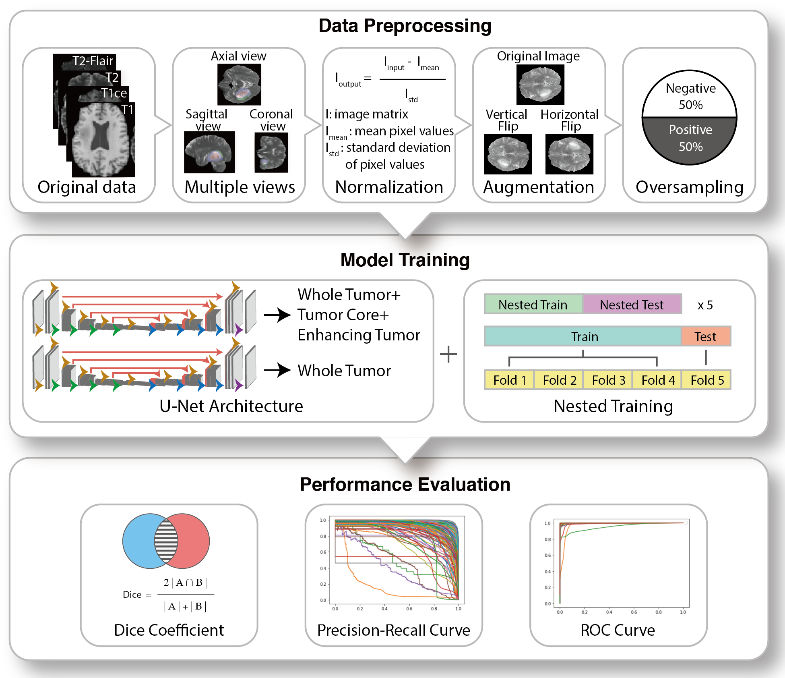
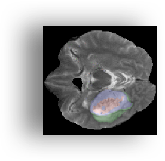
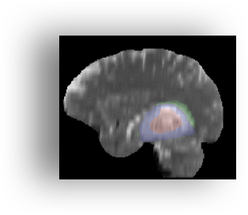
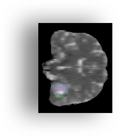
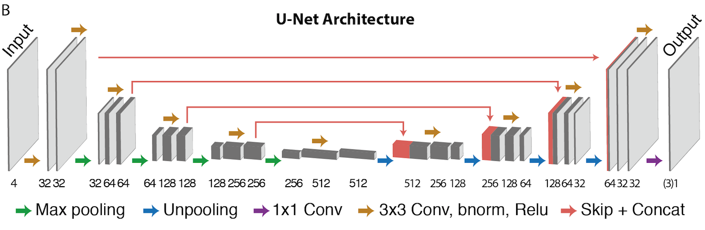
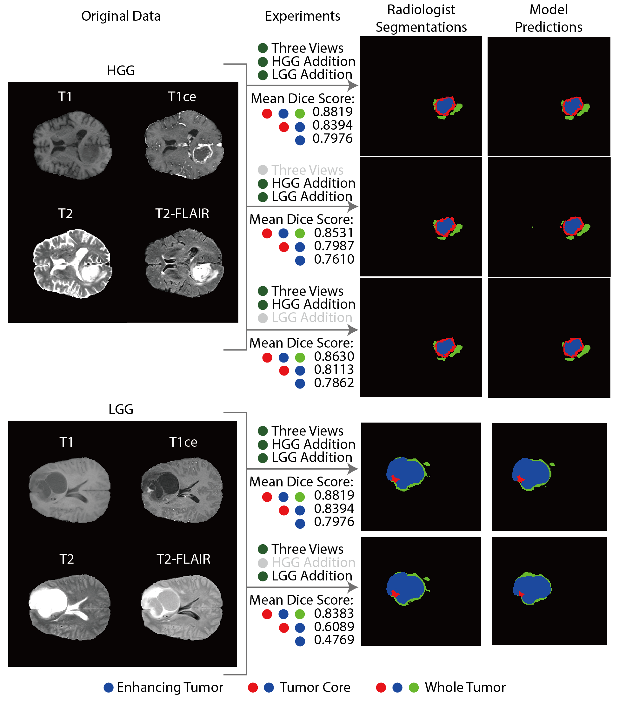

The Multimodal Brain Tumor Segmentation Challenge 2018 [(BraTS 2018)](https://www.med.upenn.edu/sbia/brats2018.html), a machine learning competition where the goal was to automatically segment brain glioma from multimodal MRI scans, has just ended. We participated with a team of 3 members from the [Guan lab](http://guanlab.ccmb.med.umich.edu/research) at University of Michigan at Ann Arbor and finished 2nd!

<!--more-->

Our team consisted of [Yuanfang Guan](https://medicine.umich.edu/dept/dcmb/yuanfang-guan-phd), [Hongyang Li](https://medicine.umich.edu/dept/dcmb/hongyang-li), and [Shaocheng Wu](http://www-personal.umich.edu/~shaochwu/). 

  
## Overview

This blog post is going to be long, here is a clickable overview of different sections.

* [Introduction](#intro)
* [Pre-processing and data augmentation](#prep)
* [Network architectures](#nn)
* [Training and ensembling](#train)
* [Software and hardware](#soft)
* [Conclusion](#conclusion)

  
## Introduction

### The problem

One of the goals of this year's BraTS competition was to segment brain gliomas from a set of pre-operative MRI scans. These segmentations are used by practitioners for disease diagnosis, treatment decision, and prognosis prediction. Segmenting brain glioma can be challenging because of its heterogeneous nature and subjective decisions from individual radiologists. Moreover, for a skilled radiologist, analysis of multimodal MRI scans can take up to 20 minutes and therefore, making this process automatic is obviously useful.

Just like previous BraTS competitions, this year's competition provided dataset from multiple institutions with different MRI protocols, which required a lot more focus on dealing with inconsistencies and variances in the way the limited number of data points were gathered. As a result, most of our efforts went to trying out different ways to preprocess and combine different kinds of data.

### The data

The dataset consisted of routine clinically-acquired preoperative multimodal MRI scans of 210 glioblastoma (GBM/HGG) and 75 lower grade glioma (LGG) patients. A total of 44175 scans contain four MRI series, namely T1-weighted (T1), post-contrast T1-weighted (T1Gd), T2-weighted (T2), and T2 Fluid Attenuated Inversion Recovery (T2-FLAIR) volumes. These scans were acquired with different clinical protocols and various scanners from 19 different institutions. Manual segmentation of three types of tumor tissue including the GD-enhancing tumor (ET), the peritumoral edema (ED), and the necrotic and non-enhancing tumor core (NCR/NET) was provided for each case.    

<table>
    <tr>
        <th>T1</th>
        <th>T2</th>
        <th>T1ce</th>
        <th>T2-FLAIR</th>
        <th>Label</th>
    </tr>
    <tr>
        <th></th>
        <th></th>
        <th></th>
        <th></th>
        <th></th>
    </tr>
</table>

All the patients have these four types of MRI scans but not all patients have all three regions labeled. Some patients don't have ET or NCR/NET labeling.

Combining these four types of data can be difficult, but dealing with inconsistencies in the data was also challenging since the dataset comes from multiple institutions with different protocols.

### The evaluation

Given a patient’s data, we were asked to use the "Dice score", and the "Hausdorff distance" to evaluate our models. Expanding upon this evaluation scheme, the metrics of "Sensitivity" and "Specificity" were also used, allowing to determine potential over- or under-segmentations of the tumor sub-regions by participating methods. The evaluation was performed on the enhancing tumor (ET), tumor core (NCR/NET+ET), and whole tumor (NCR/NET+ET+ED). 

There were three stages in the segmentation part of this competition. In the first stage, we were given a training dataset of 285 patients. In the second stage, a validation dataset consisting of 66 patients was released. In the final stage, the organizers released the test data of xxx patients to assess the performances of participating methods. 

  
## The solution: three-view-assembled approach, normalization, and combined training

Our method consists of three major components, each greatly improving our algorithm performance. First, we assemble three anatomical views as input to our 2D model to maintain spatial information of brain glioma. Second, the robustness of combing HGG and LGG in training is originated from their complementary relationship. Their integration can provide more information to delineate glioma landscape. Third, the heterogeneous intensity in MRI scans is addressed by normalization over whole brain volumes, which leads to a cleaner dataset. Unlike many other contestants, we performed ** no hand-labelling **. 

<table>
    <tr><h4 style="text-align: center;">Overview of our workflow</h4></tr>
    <tr></tr>
</table>

  
## Pre-processing and data augmentation

We were provided a limited number of MRI scans and they had varying intensity. Our preprocessing pipeline increased the quantity of the scans and made them ready to be fed to a U-Net-based network by going through the following steps:

### Three-view-assembled approach
Because BraTS 2018 training dataset contains only the axial slices with the shape of 240 by 240, we then generated slices from other 2 planes (coronal and sagittal) and they were zero-padded into 240 by 240 as the original axial slices. This approach helped enlarging the training size and preserving spatial information of brain glioma.  

<table>
    <tr>
        <th>Axial view</th>
        <th>Sagittal view</th>
        <th>Coronal view</th>
    </tr>
    <tr>
        <th></th>
        <th></th>
        <th></th>
    </tr>
</table>    

### Normalization over the whole brain volume
To address the heterogeneous intensity of MRI scans,  we calculated the means and standard deviations of pixel array for each patient and normalized it through subtracting the mean and then divided by the standard deviations for each modality and each anatomical plane.

### Data augmentation and oversampling
To avoid overfitting, we deployed two types of data augmentation. First, slices were flipped in either left/right or up/down direction at a random chance. The corresponding labels were also processed in the same manner. Second, to address the class imbalance, we oversampled slices with positive labels to balance positive/negative ratio. 
    
### Combined training
We combined high-grade glioma (HGG) cases and low-grade glioma (LGG) cases in the training stage and found that it improved the predictions on both HGG and LGG cases.
  

## Network architectures

We used typical U-Net architecture 24 (Fig 2), which took in 2D image arrays with four channels (T2-FLAIR, T2, T1, and T1Gd). Then the inputs went through a series of convolutional and pooling layers and were turned into feature maps with smaller size. The resulting feature maps then pass a series of up-convolutional and concatenating layers and finally, the network output a segmentation mask either with only one label channel for whole tumor region (three subregions combined) or with three separated label channels (for three subregions: the necrotic (NCR) and non-enhancing (NET) tumor core, peritumoral edema, and GD-enhancing tumor). 

| Layer Type        | Size                   | Output shape         |
|-------------------|------------------------|----------------------|
| Input layer       |                        | (240, 240, 4)*       |
| Convolution       | 32 filters of 3x3      | (240, 240, 32)       |
| Convolution       | 32 filters of 3x3      | (240, 240, 32)       |
| Max pooling       |                        | (120, 120, 32)       |
| Convolution       | 64 filters of 3x3      | (120, 120, 64)       |
| Convolution       | 64 filters of 3x3      | (120, 120, 64)       |
| Max pooling       |                        | (60, 60, 64)         |
| Convolution       | 128 filters of 3x3     | (60, 60, 128)        |
| Convolution       | 128 filters of 3x3     | (60, 60, 128)        |
| Max pooling       |                        | (30, 30, 128)        |
| Convolution       | 256 filters of 3x3     | (30, 30, 256)        |
| Convolution       | 256 filters of 3x3     | (30, 30, 256)        |
| Max pooling       |                        | (15, 15, 256)        |
| Convolution       | 512 filters of 3x3     | (15, 15, 512)        |
| Convolution       | 512 filters of 3x3     | (15, 15, 512)        |
| Skip+concatenate  |                        | (30, 30, 512)        |
| Convolution       | 256 filters of 3x3     | (30, 30, 256)        |
| Convolution       | 256 filters of 3x3     | (30, 30, 256)        |
| Skip+concatenate  |                        | (60, 60, 256)        |
| Convolution       | 128 filters of 3x3     | (60, 60, 128)        |
| Convolution       | 128 filters of 3x3     | (60, 60, 128)        |
| Skip+concatenate  |                        | (120, 120, 128)      |
| Convolution       | 64 filters of 3x3      | (120, 120, 64)       |
| Convolution       | 64 filters of 3x3      | (120, 120, 64)       |
| Skip+concatenate  |                        | (240, 240, 64)       |
| Convolution       | 32 filters of 3x3      | (240, 240, 32)       |
| Convolution       | 32 filters of 3x3      | (240, 240, 32)       |
| Convolution       | 3/1 filters of 1x1     | (240, 240, 3/1)**    |

\* The third dimension is the channel size, which stands for the number of MRI modalities.

\** The last layer with 3 filters of 1x1 with output shape of (240, 240, 3) was used for three-region model. That with 1 filters of 1x1 with output shape of (240, 240, 1) was used for whole-tumor-only model.

### Three-region model

Three-region model takes an image array with four channels (for four MRI modalities) as an input, and try to segment all three regions from it at the same time. The output of this model is a segmentation mask with three channels corresponding to enhancing tumor, tumor core, and whole tumor. 

This model benefitted most from the three-view assembled approach, which helped reduce the false positive labels outside the whole tumor and also increase the size of training samples. It proved to be very robust and applicable to all patients, regardless a HGG or a LGG case.

In the validation dataset, our three-region model achieved mean dice scores of 0.8819, 0.8307, and 0.7976 for three regions, which was a reliable estimate for the public leaderboard score for this model.

<table>
    <tr>
        <th>T1</th>
        <th>T2</th>
        <th>T1ce</th>
    </tr>
    <tr>
        <th></th>
        <th></th>
        <th></th>
    </tr>
    <tr>    
        <th>T2-FLAIR</th>
        <th>Ground Truth</th>
        <th>Prediction</th>
    </tr>
    <tr>
        <th></th>
        <th></th>
        <th></th>
    </tr>
</table>

### Whole-tumor-only model

With the decent segmentation performance from three-region model, we conducted further experiments to investigate whether models that independently output segmentations of regions can improve performance. We found that only the model for whole tumor region achieved higher accuracy, with a mean dice score of 0.906, a mean AUROC of 0.998, and a mean AUPRC of 0.950. This could be attributed to the fact that volumes from some patients have little or even no tumor core or enhancing tumor regions labeled while all the patients have whole tumor region labeled. Low quantity of positive labels from tumor core and enhancing tumor regions result in less comprehensive segmentations of corresponding regions.

<table>
    <tr>
        <th>T1</th>
        <th>T2</th>
        <th>T1ce</th>
    </tr>
    <tr>
        <th></th>
        <th></th>
        <th></th>
    </tr>
    <tr>
        <th>T2-FLAIR</th>    
        <th>Label</th>
        <th>Whole-tumor-only</th>
    </tr>
    <tr>
        <th></th>
        <th></th>
        <th></th>
    </tr>
</table>

  
## Training and ensembling

**Error function**. We experimented with various error functions, but we found optimising dice coefficient directly to work best.

**Training algorithm**. To train the parameters of our models, we used the Adam update rule ([Kingma and Ba](http://arxiv.org/abs/1412.6980)).

**Regularization**. Since we had a low number of patients, we needed considerable regularization to prevent our models from overfitting. Our main approach was to augment the data and to balance the positive and negative ratio.

### Experiments

We've conducted several experiments to see how their performances go compared to our final models. The experiments included model without three-view-assembled approach and model without combined training. 

<table>
    <tr><h4 style="text-align: center;">Prediction examples</h4></tr>
    <tr></tr>
</table>

## Software and hardware

We used [Python](https://www.python.org/), [Numpy](http://www.numpy.org/) and [Keras](https://keras.io) with [Tensorflow](https://www.tensorflow.org) backend to implement our solution, in combination with the [cuDNN](https://developer.nvidia.com/cudnn) library. We made use of [scikit-image](http://scikit-image.org/) and [NiBabel](http://nipy.org/nibabel/) for pre-processing and augmentation.

We trained our models on the NVIDIA GPUs that we have in the lab, which include GTX TITAN X cards. We would like to thank ...

## Conclusion

In this competition, we tried out different ways to preprocess data and combine information from different types of data, and thus, we learned a lot in this aspect. However, we feel that there is still a room for improvement. For example, we observed that most of our error still hails from a select group of patients. Altogether, our proposed model demonstrated its potential and scope in segmenting multi-modalities of brain tumor and it can be of immediate use to neuro-oncologists or radiologists, improving the diagnosis of brain tumor in terms of not only speed but also accuracy. 

Github: The code is now available on GitHub: [https://github.com/GuanLab/Brain_Glioma](https://github.com/GuanLab/Brain_Glioma)

